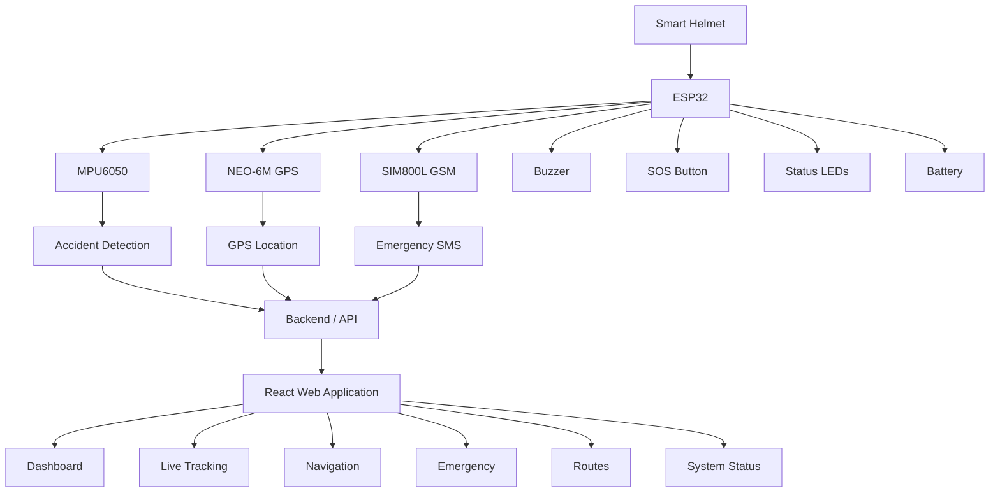
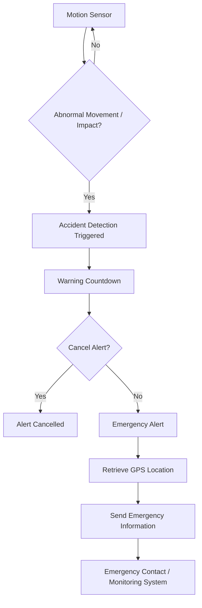

# 🪖 Smart Helmet

A smart helmet safety system designed to improve rider safety through accident detection, real-time GPS tracking, emergency alerts, SOS assistance, navigation, route monitoring, and system status tracking.

The project combines a modern web-based interface with smart helmet hardware concepts to provide faster emergency response and enhanced rider protection.

---

## 📌 Project Overview

Road accidents can happen unexpectedly, and delayed emergency response can make the situation more dangerous.

The **Smart Helmet** project aims to provide an intelligent safety system that can detect accidents, track the rider's location, and assist in sending emergency alerts.

The system is designed with both software and hardware integration in mind, allowing helmet sensors and communication modules to work together with a web-based monitoring platform.

---

## ✨ Features

- 🚨 **Automatic Accident Detection**
  - Detects sudden impacts and abnormal movements using motion sensors.

- 📍 **GPS Location Tracking**
  - Tracks the helmet's location using GPS coordinates.

- 🆘 **Emergency SOS**
  - Allows the rider to manually trigger an emergency alert.

- 📱 **Emergency Alerts**
  - Designed to provide accident location information for emergency response.

- ⏱️ **False Alert Cancellation**
  - Provides a countdown period to cancel an accidental emergency trigger.

- 🗺️ **Live Tracking**
  - Displays the helmet's current location on an interactive map.

- 🧭 **Navigation**
  - Allows users to search for locations and calculate routes.

- 🛣️ **Route Monitoring**
  - Displays route distance, estimated travel time, speed, and ride progress.

- 🔧 **System Status**
  - Monitors the status of connected helmet components.

- 🔋 **Battery Monitoring**
  - Displays battery and system health information.

- 🔊 **Buzzer Warning**
  - Provides an audible warning during emergency detection.

- ⚙️ **Settings**
  - Provides controls for system preferences and user configuration.

- ❓ **Help & Support**
  - Provides information and assistance for using the system.

---

## 🛠️ Hardware Components

The system is designed to support the following hardware components:

| Component | Purpose |
|---|---|
| ESP32 | Main microcontroller |
| MPU6050 | Accelerometer and gyroscope for motion and accident detection |
| NEO-6M GPS | GPS location tracking |
| SIM800L | GSM communication and emergency SMS |
| Buzzer | Audible emergency warning |
| SOS Button | Manual emergency activation |
| Rechargeable Li-ion Battery | Portable power supply |
| Status LEDs | System and hardware status indication |

---

## 💻 Software & Technologies

### Frontend

- React
- Vite
- JavaScript
- HTML
- CSS
- Lucide React
- Leaflet
- React Leaflet
- OpenStreetMap

### Backend

- Node.js
- Express.js

### Mapping & Navigation

- Leaflet
- OpenStreetMap
- Nominatim
- OSRM

### Development Tools

- Visual Studio Code
- Git
- GitHub

---

## 🏗️ System Architecture



---

## 🚨 Emergency Detection Flow



---

## 🗺️ Navigation & Tracking

The application provides an interactive map interface for:

- 📍 Viewing the helmet's current location
- 🔎 Searching for locations
- 🏁 Selecting starting and destination points
- 🛣️ Calculating routes
- 📏 Displaying route distance
- ⏱️ Displaying estimated travel time
- 📊 Monitoring ride progress

The mapping interface is built using **Leaflet and OpenStreetMap**, while location search and route calculation are supported through mapping services.

---

## 📂 Project Structure

```text
Smart-Helmet/
│
├── backend/
│   ├── server.js
│   ├── package.json
│   ├── package-lock.json
│   ├── .env.example
│   └── README.md
│
├── frontend/
│   ├── public/
│   ├── src/
│   │   ├── pages/
│   │   ├── assets/
│   │   ├── App.jsx
│   │   ├── App.css
│   │   ├── index.css
│   │   └── main.jsx
│   ├── package.json
│   ├── package-lock.json
│   └── vite.config.js
│
├── package.json
├── package-lock.json
└── .gitignore
```

---

## ⚙️ Installation & Setup

### 1. Clone the Repository

```bash
git clone https://github.com/Saisaran-2007/Smart-Helmet.git
```

### 2. Navigate to the Project

```bash
cd Smart-Helmet
```

### 3. Install Frontend Dependencies

```bash
cd frontend
npm install
```

### 4. Install Backend Dependencies

Open another terminal:

```bash
cd Smart-Helmet/backend
npm install
```

### 5. Start the Frontend

From the frontend directory:

```bash
npm run dev
```

The application will be available on the local development server provided by Vite.

### 6. Start the Backend

From the backend directory:

```bash
npm start
```

---

## 📸 Screenshots

Screenshots of the Smart Helmet web application can be added below.

### 🏠 Dashboard

_Add dashboard screenshot here._

### 📍 Live Tracking

_Add live tracking screenshot here._

### 🧭 Navigation

_Add navigation screenshot here._

### 🚨 Emergency

_Add emergency page screenshot here._

### 🔧 System Status

_Add system status screenshot here._

### ⚙️ Settings

_Add settings screenshot here._

---

## 🎯 Project Objectives

The main objectives of the Smart Helmet project are:

- Improve rider safety
- Detect accidents automatically
- Provide accurate location information
- Enable faster emergency response
- Provide manual SOS assistance
- Monitor helmet hardware status
- Provide navigation and route assistance
- Create a scalable platform for future hardware integration

---

## 🚀 Future Enhancements

- 🔌 Full ESP32 hardware integration
- 📡 Real-time sensor telemetry
- 📍 Real-time GPS updates from the helmet
- 📱 Dedicated mobile application
- 📞 Automated emergency calling
- ☁️ Cloud-based telemetry storage
- 🔔 Push notifications
- 👥 Multiple emergency contacts
- 📊 Ride history and analytics
- 🤖 Advanced accident detection using machine learning
- 🔋 Advanced battery monitoring

---

## 👨‍💻 Developer

**Sai Saran R**

Smart Helmet — Rider Safety & Emergency Assistance System

---

## 📄 License

This project is currently intended for educational and academic purposes.
